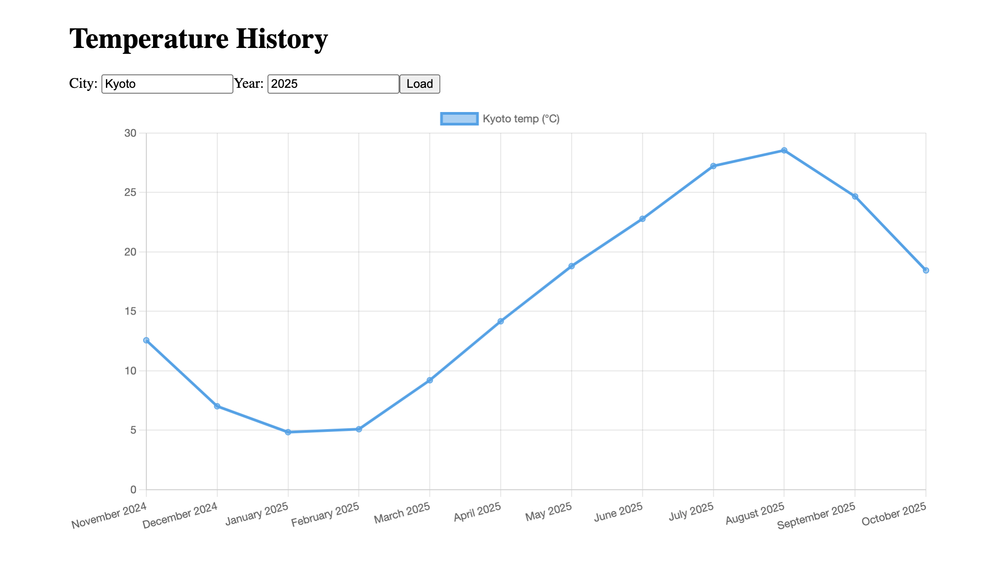

# Temperature History Dashboard

A containerized full-stack web application that displays the **past 12 months of temperature data** using a **React.js frontend**, **Express.js backend**, and **MySQL database**.  
The entire stack runs on **Kubernetes** (via Docker Desktop) with **Ingress** routing.

---

## Features

- Displays monthly temperature values for the last year
- REST API served by Express.js
- React.js frontend with dynamic charts
- Persistent MySQL database running locally
- Fully containerized with Docker
- Kubernetes manifests for:
  - Frontend Deployment + Service
  - Backend Deployment + Service
  - MySQL Deployment + Persistent Volume
  - Ingress routing

---

## Architecture Overview

React App (Frontend)
|
Ingress Controller
|
Express API (Backend)
|
MySQL (Local Mac)

- React and Express run in separate containers
- MySQL runs directly on macOS (not containerized)
- Kubernetes handles routing & load balancing

---

## Tech Stack

- **Frontend:** React.js
- **Backend:** Node.js + Express
- **Database:** MySQL (local)
- **Containerization:** Docker
- **Orchestration:** Kubernetes (Docker Desktop)
- **Ingress:** NGINX ingress controller

---

## Screen Shots

